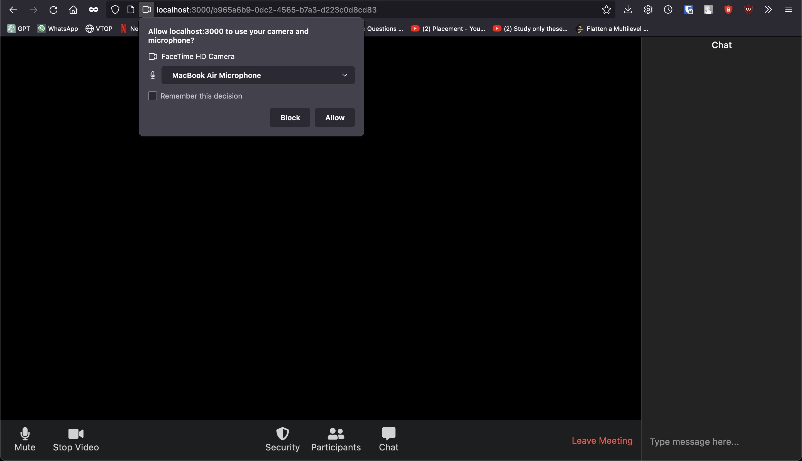
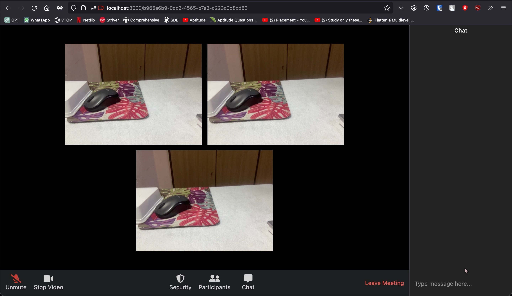

<h1 align="center">
  <br>
  
  <br>
  Welcome to MeeTUp 👋
  <br>
</h1>
<h4 align="center">A web application built using Node JS with Socket.IO that allows you to connect with your friends virtually.</h4>

<p align="center">
  <a href="#introduction">Introduction</a> •
  <a href="#application-in-action">Application in Action</a> •
  <a href="#flow">Flow</a> •
  <a href="#installation">Installation</a> •
  <a href="#application-structure">Application Structure</a> •
  <a href="#key-features">Key Features</a> •
  <a href="#how-to-use">How To Use</a> •
  <a href="#credits">Credits</a> •
</p>

## Introduction

Welcome to MeeTUp, this is a web application that allows you to connect with your friends virtually through video and audio. An Application with multi-party call features using video and audio. Also added chat functionality to send data to all instant ease of use.

The main goal of this application is to get through the pandemic that happened and allow education, work, training, and anything possible. To continue  our lifestyle as the way it was with a little bit of adjustments.

## Application in Action





## Flow
- Start/Initialize the application
- Put on the first page
- Create room using sockets.io
- add video and broadcast to all
- add all others to broadcast to all
- style it
- Create a messaging system
- do mute and unmute ability
- similarly, for video, switch it on and off
- and pretty much done...


## Installation

Install with NPM:

```
Make sure Node JS is installed

> npm install
```

## Application Structure

```
.
└── MeeTUp/
    ├── node_modules
    ├── public/
    │   ├── logo.png
    │   ├── script.js
    │   ├── style.css
    ├── Screenshots/
    │   ├── 1.png
    │   ├── 2.png
    ├── views/
    │   ├── index.ejs
    ├── .gitignore
    ├── app.js
    ├── package-lock.json
    ├── package.json
    ├── README.md
```

## Key Features

⭐️ Video & Audio - Allows you to stream your web feed video & audio which will be broadcasted to members.

⭐️ Chat Feature - Uses sockets to send text messages to the room members in an instant.


## How To Use

To clone and run this application, you'll need [Git](https://git-scm.com) and [Node JS](https://nodejs.org/).

From your command line:

```bash
Make sure Node JS is installed

# Clone the application
> git clone https://github.com/calicartels/MeeTUp

# Enter into the directory
> cd MeeTUp

# Install the necessary packages
> npm install

# Enjoy the application
> npm start
```
The application will be running in http://localhost:3000/.

## Credits

This software uses the following open source packages:

- [Node JS](https://nodejs.org/)
- [Socket.IO](https://socket.io)
- [EJS](https://www.ejs.co/)
- [Express](https://www.expressjs.com/)
- [Bootsrap](https://www.getbootstrap.com/)
- [Javascript](https://www.javascript.com/)


## 📝 License


MIT

---


> Copyright © 2023 [@N-liraj-khanna](https://github.com/N-liraj-khanna) &nbsp;&middot;&nbsp;

